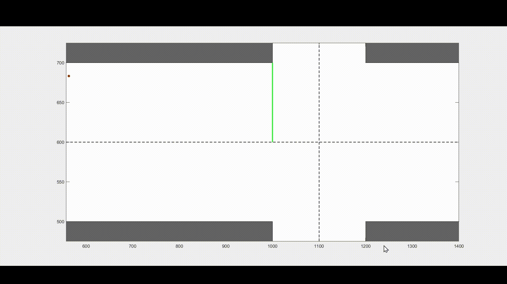

# Coordinated Control of Autonomous Vehicles for Traffic Density Reduction at a Signalized Junction: An MPC Approach
The effective and safe management of traffic is a key issue due to the rapid advancement of the urban transportation system. Connected autonomous vehicles (CAVs) possess the capability to connect with each other and adjacent infrastructure, presenting novel opportunities for enhancing traffic flow and coordination. This work proposes a dual-mode model predictive control (MPC) architecture that tackles two interrelated issues: mitigating traffic density at signalized junctions and facilitating seamless, cooperative lane changes in high-density traffic conditions. The objective of this work is to facilitate responsive decision-making for CAVs, thereby enhancing the efficiency and safety of urban mobility. Moreover, we ensure recursive feasibility and convergence of the proposed MPC scheme by the integration of an online-calculated maximal control invariant terminal set. Finally, the efficacy of the proposed approach is validated through numerical simulation.

