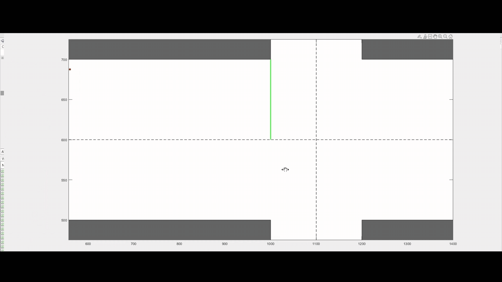
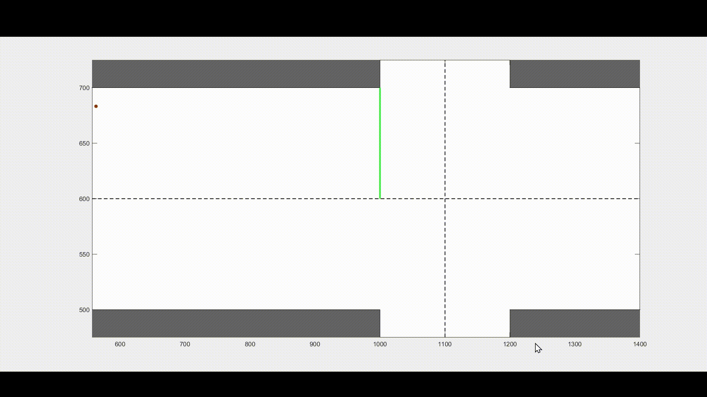

# Coordinated Control of Autonomous Vehicles for Traffic Density Reduction at a Signalized Junction: An MPC Approach
The effective and safe management of traffic is a key issue due to the rapid advancement of the urban transportation system. The connected autonomous vehicles transportation
system possesses the capability to connect the vehicles with each other and adjacent infrastructure, presenting novel opportunities for enhancing traffic flow and coordination. This work proposes a control architecture that tackles two interrelated issues: mitigating traffic density at signalized junctions and facilitating seamless cooperative lane changes. To address them, reference velocity trajectories are first computed for each autonomous vehicle, and then they are guided to achieve the desired objectives through the
implementation of a dual-mode model predictive control (MPC) mechanism. The MPC-related issues, such as recursive feasibility and convergence of the proposed MPC scheme, are achieved by the integration of an online-calculated maximal control invariant terminal set. Finally, the efficacy of the proposed approach is validated through numerical simulations.

<figure>
  
  <figcaption align = "center"><i>Coordination and Lane Change using 52 CAVs.</i></figcaption>
</figure>
 
<figure>
  
  <figcaption align = "center"><i>Coordination and Lane Change using 20 CAVs.</i></figcaption>
</figure>
